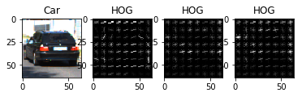
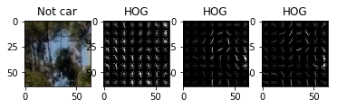
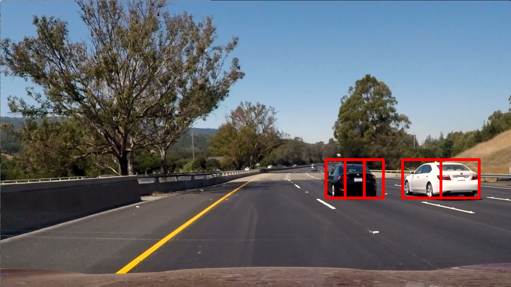

**Vehicle Detection Project**

The goals / steps of this project are the following:

* Perform a Histogram of Oriented Gradients (HOG) feature extraction on a labeled training set of images and train a classifier Linear SVM classifier
* Optionally, you can also apply a color transform and append binned color features, as well as histograms of color, to your HOG feature vector. 
* Note: for those first two steps don't forget to normalize your features and randomize a selection for training and testing.
* Implement a sliding-window technique and use your trained classifier to search for vehicles in images.
* Run your pipeline on a video stream (start with the test_video.mp4 and later implement on full project_video.mp4) and create a heat map of recurring detections frame by frame to reject outliers and follow detected vehicles.
* Estimate a bounding box for vehicles detected.

[//]: # (Image References)
[Cars]: ./output_images/cars.png
[Not Cars]: ./output_images/not_cars.png
[Hog]: ./output_images/hog.png
[Hog car]: ./output_images/hog_car.png
[Hog not car]: ./output_images/hog_notcar.png
[Test]: ./output_images/test.png
[Result short]: ./output_videos/test_video.mp4
[Result full]: ./output_videos/project_video.mp4

## [Rubric](https://review.udacity.com/#!/rubrics/513/view) Points
Main goal of this project is to detect vehicles on the road. To achieve this we need to apply different techniques and algorithms which are described below.

#### Extracting features
First step in identifying vehicles at given image is feature extraction. Depending on task we could use different set of features. For this project we will use various histograms (like color [histograms - see utils/features.py, lines 29-33](utils/features.py#L29-L33) and [oriented gradients - see utils/features.py, lines 8-22](utils/features.py#L8-L22)).
Common method for extracting features could be found at [utils/features.py, lines 36-L84](utils/features.py#L36-L84).

After several experiments with different color spaces I decided to use `YCrCb` color space and following parameters for HOG:
```
Color space: YCrCb
HOG orientations: 9
HOG pixels per cell: 8 
HOG cells per block: 2
Spatial binning dimensions: 32x32
Number of histogram bins: 32
```


HOG visualization for cars and not cars images shown below:






#### Classifier
Second step is training classifier. I decided to use simple but powerful enough for given task - [Linear SVM Classifier](http://scikit-learn.org/stable/modules/generated/sklearn.svm.LinearSVC.html).
Initial data was split into training and test sets. Size of test set is 20%.
You can see actuall code in [CarND-Vehicle-Detection.ipynb, section 5](CarND-Vehicle-Detection.ipynb).
Accuracy on test set is 99%.


#### Sliding windows
Third step is implementing sliding windows algorithm which allows us to slide over input image and detect vehicles.
Main idea of this method is that we divide image into N pieces and then process them one by one trying to detect vehicle.
Check methods slide_window and search_windows in [utils/windows.py](utils/windows.py).
It was clear from beginning that using single-size window won't be enough. Vehicles could have different sizes, distance between us and specific vehicle cold differ too (perspective problem). To covers all these cases we should use more then one window dimension. Also it is clear that we could save some time by pre-defining areas where vehicles most likely appear.
Having all that in mind following config was created and used in in methods mentioned above:
```
windows_cfg = [
  {
    'x_start_stop': [ None, None ],
    'y_start_stop': [ 400, 656 ],
    'xy_window': ( 256, 256 ),
    'xy_overlap': ( 0.5, 0.5 )
  },
  {
    'x_start_stop': [ None, None ],
    'y_start_stop': [ 400, 656 ],
    'xy_window': ( 128, 128 ),
    'xy_overlap': ( 0.6, 0.5 )
  },
  {
    'x_start_stop': [ 100, 1280 ],
    'y_start_stop': [ 400, 500 ],
    'xy_window': ( 96, 96 ),
    'xy_overlap': ( 0.7, 0.5 )
  },
  {
    'x_start_stop': [ 500, 1280 ],
    'y_start_stop': [ 400, 500 ],
    'xy_window': ( 48, 48 ),
    'xy_overlap': ( 0.7, 0.5 )
  }
]
```
After applying sliding windows algorithm we have multiple boxes with possible vehicle locations. Applying heat maps allows us to get final rectangles from all matching boxes.

Result could be seen on this image:



#### Video Implementation
Final step - apply all methods described above to video stream.
Actual implementation could be found in [utils/video.py](utils/video.py).

Result videos:

[](https://www.youtube.com/watch?v=bjsA6Py-sbo)

[](https://www.youtube.com/watch?v=b3wxAFnLdqg)


---

### Discussion

My implementation is not ideal and could be improved for sure.
On given examples my model looks fine but I'm sure that different light or weather conditions will make things worse.
To make model more robust in future I'll try to find features that invariant to light or weather conditions. 
More time could be spend on designing more advanced sliding windows algorithm (maybe dynamically changing window-dimensions). Playing with thresholds parameters could give some improvements too. I'm also interesting in trying different classifiers, maybe pre-trained ML-models (main concern against using them is speed; but I'll spend more time on this subject).
